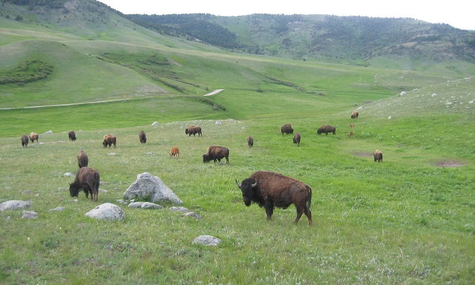

```{r setup, include=FALSE}
knitr::opts_chunk$set(echo = TRUE)
```

## Reasearch objective

The aim of my project was to predict Soil Organic Matter (SOM) content in a small area in the Great Plains in the United States. SOM is defined as any material produced originally by living organisms (plant or animal) that is returned to the soil and goes through the decomposition process. The presence of SOM is regarded as being critical for soil function and soil quality. For the prediction, three different methods were tested and compared: prediction from a Random Forest model, from a linear regression model and by applying Regression Kriging, which is an extension of the linear regression method. By looking into the literature, three different independent variables were selected that influence the SOM content: vegetation cover, land surface temperature and soil wetness. For every method, the Root Mean Square Error (RMSE) gives an indication of the accuracy of the prediction. 

```{r main, echo=FALSE, include=FALSE}
source('main.R')
```


## Study area

The study area that was chosen is an area of about 20 square kilometers in the Great Plains in the US, close to the city of Denver. The area is covered in prairie, steppe and grassland. This area was chosen, because a dataset was available that consists of point measurements of the SOM content within this area. The measurements were acquired in 2013 for the MSc thesis of Pierre Jongerius, and were provided to me for another type of exercise during the Advanced GIS for Earth and Environment course that I followed two years ago. 


## Datasets and preprocessing

The SOM measurements are used as reference data for this research. Exactly 100 measurements were done and they were already divided in 78 measurements to be used for calibration purposes and 22 measurements to be used for validation purposes. The measurement locations are shown in the plots below.The background in these plots is a hillshade map generated from a Digital Elevation Model (DEM), representing the terrain. 


```{r refpoints, echo=FALSE}
SlopeAsp <- terrain(dem_area, opt=c('slope', 'aspect'))
hills <- hillShade(SlopeAsp[['slope']], SlopeAsp[['aspect']])
cls <- colorRampPalette(c('white', 'black'))
cols <- colorRampPalette(c('yellow', 'brown'))
spplot(refpoints, zcol='Validation', col.regions=c('red', 'blue'), main='SOM calibration and validation points') + as.layer(spplot(hills, col.regions=rev(cls(255))), under=TRUE)
spplot(refpoints, zcol='OM_in__', col.regions=cols(255), main='SOM content in % of the total soil composition') + as.layer(spplot(hills, col.regions=rev(cls(255))), under=TRUE)
```


The independent variables are derived from different raster products. Together with the point measurement data, a high resolution 1 m DEM of the area was also provided. Besides that, a Landsat 8 image taken at the 26th of September, 2013, was downloaded. The sections below will explain how the independent variables are derived from these data products. 


### Vegetation cover

For the vegetation cover, the Normalised Difference Vegetation Index (NDVI) was derived from the Landsat 8 image. First, the Digital Numbers (DN) in the image were converted to the Top Of Atmosphere (TOA) reflectance values by using the coefficients provided in the metadata file of the Landsat image. The red and Near Infrared (NIR) bands, bands 4 and 5 respectively, were used in the following formula: 

NDVI = (NIR-red) / (NIR+red). 

A plot of the NDVI image is shown below:

```{r ndvi, echo=FALSE}
plot(ndvi, main='NDVI')
```


### Land surface temperature

The Land Surface Temperature (LST) was derived from the same Landsat image. This time, the Thermal Infrared band (band 10) was used. The method to derive LST from a Landsat image was taken from the following source:

http://www.gis-blog.com/calculation-of-land-surface-temperature-lst-from-landsat-8-using-r/

A plot of the LST image is shown below:

```{r LST_celsius, echo=FALSE}
cl <- colorRampPalette(c('blue', 'skyblue', 'yellow', 'red'))
plot(LST_celsius, main='LST in degrees Celsius', col=cl(255))
```


### Soil wetness

For the soil wetness, the Topographic Wetness Index (TWI) was used. The TWI is derived from the DEM and is a function of both the slope and the upstream contributing area per unit width orthogonal to the flow direction. The DEM was first resampled to the same extent and resolution as the Landsat image. Then the TWI was calculated by using the upslope.area() function with the argument 'atb=TRUE' from the R package 'dynatopmodel'. 

A plot of the TWI image is shown below:

```{r twi, echo=FALSE}
colFunc <- colorRampPalette(c('white', 'blue'))
plot(twi, main='TWI', col=colFunc(255))
```


## Methods and results

After the preprocessing was done, both a RandomForest model and a Linear model were generated from the data. To establish these models, values for the independent variables were extracted to the measurement points. Then the models were generated by aiming to predict the SOM content from the NDVI, LST and TWI values at the measurement locations. 

### Models


#### RandomForest model

The code below shows how the RandomForest model has been generated. The varImpPlot() function is used to show the importance of the variables in the model. 

```{r modelRF}
califrame <- data.frame(calibration)
modelRF <- randomForest(x=califrame[, c(3, 4, 5)], y=califrame$OM_in__, importance=T)
varImpPlot(modelRF)
```

The variable importance plots above show the mean decrease in accuracy (left) and the decrease in Gini Impurity Coefficient (right) for each variable. It can be seen that the TWI has the highest impact on the accuracy and also scores highest with the Gini impurity criterion. 


#### Linear regression model

The code below shows how the linear regression model was generated. The function summary() is called to show the model coefficients that are estimated. 

```{r lmSOM}
lmSOM <- lm(OM_in__~ndvi+lst+twi, data=calibration)
summary(lmSOM)
```

The above information shows the linear model coefficients that are estimated using the least squares regression method, which determines the best fit line to the data by minimizing the sum of squared residuals. Here, the Pr value represents the probability of the nul hypothesis (zero correlation). As can be seen, all independent variables seem to be significantly correlated using a 1% significance level (Pr < 0.01). 


### Prediction

After the models were generated, these models were used to predict the SOM content in the whole study area. To do that, the independent variable rasters were combined in a rasterBrick:

```{r br}
br <- brick(ndvi, LST_celsius, twi)
names(br) <- c("ndvi", "lst", "twi")
```

Then, three different methods were used for the prediction: prediction from a RandomForest model, prediction from a linear regression model and Regression Kriging. 


#### Prediction from a RandomForest model

The prediction from the RandomForest model was done using the raster predict function:

```{r SOM_rf}
SOM_rf <- predict(br, modelRF)
```


#### Prediction from a linear regression model

The prediction from a linear regression model was also done using the raster predict function: 

```{r SOM_regression}
SOM_regression <- predict(br, lmSOM)
```


#### Regression Kriging

The Regression Kriging method is an extension of the linear regression method. In this method, the residuals in the measurement points (difference between predicted SOM and measured SOM) are taken from the linear regression model and are interpolated using a simple Kriging interpolation. The interpolated residuals are then added to the regression prediction. Interpolating the residuals makes sense if these residuals are spatially correlated. This can be investigated by looking at the variogram of the residuals, which is describing the degree of spatial dependence of a spatial random field or stochastic process. From literature it is known that this method is very powerful to predict SOM content with a high accuracy. I will not go further into details about the Kriging interpolation technique, since that is outside the scope of this course. The code to perform Regression Kriging is dependent on the R package 'gstat' and looks as follows:

```{r SOM_rk, echo=TRUE, include=TRUE, results='hide', warning=FALSE}
calibration$resid <- lmSOM$residuals
vgres  <- variogram(resid~1, calibration)
#plot(vgres)
vgmres <- vgm(nugget=3, psill=10, range=300, model="Exp")
vgmres <- fit.variogram(vgres, vgmres, fit.method=7)
#plot(vgres, vgmres)

gridframe <- as(br, "SpatialGridDataFrame")
proj4string(gridframe) <- proj4string(calibration)
SOM_rk <- krige(resid~1, calibration, newdata=gridframe,
                  model=vgmres, beta=0, nmax = 14)

SOM_rk$var1.pred <- SOM_rk$var1.pred +
  as(SOM_regression, "SpatialGridDataFrame")$layer
SOM_rk <- raster(SOM_rk)
```

### Output SOM maps

The maps below show the output SOM maps of the difference prediction methods. The plots are created using the levelplot() function of the rasterVis package. 

```{r outputs, echo=FALSE}
cols <- colorRampPalette(c('grey', 'yellow', 'brown'))
levelplot(outputs, col.regions=cols(255), main='SOM output maps (%)')
```

From the plot, it can be seen that there are some differences between the different SOM output maps. However, from the maps it is not possible to investigate which prediction was the most accurate. Therefore, the Root Mean Square Error (RMSE) was calculated for every SOM output map. 

### RMSE values

The RMSE is an indicator of the accuracy of the output maps. It is calculated by using the validation measurements that were part of the point measurement dataset that was available. The values of every SOM ouput map were extracted to the measurement points. Then the RMSE was calculated by applying the following formula:

RMSE = sqrt(mean((pred - obs)^2))

The results are presented in the table below:

```{r RMSE_overview, echo=FALSE}
head(RMSE_overview)
```

These results show that there are small differences in the accuracy of the different prediction methods, according to the validation measurements. The Regression Kriging methods shows the lowest RMSE and thus appears to be the most accurate prediction method. 


## Discussion
The aim of the research was to see how well the SOM content in the Great Plains can be predicted using a few simply derived variables. It is nice to see that indices such as NDVI, LST and TWI are useful predictors for the SOM content. However, for an accurate prediction of the SOM content, much more detailed information will be necessary, such as soil carbon, salinity, nitrogen content, plant lignin content and so on. Also, the degree to which the derivatives NDVI, LST and TWI really represent the variable that they claim to represent is doubftull. For example, the real wetness can differ from what the TWI is representing, since it depends on more than just elevation. Third, the 30 m resolution that was used is relatively low in an area of only 20 square kilometers. Using higher resolution data is likely to give more accurate results. 

The fact that Regression Kriging gave to most accurate results, was expected, because it is the only method that not only makes a prediction based on the independent variables, but also interpolates the residuals to achieve a more accurate result. This technique is also mentioned very often in the literature as one of the most accurate methods to predict SOM content in the area of interest. 

